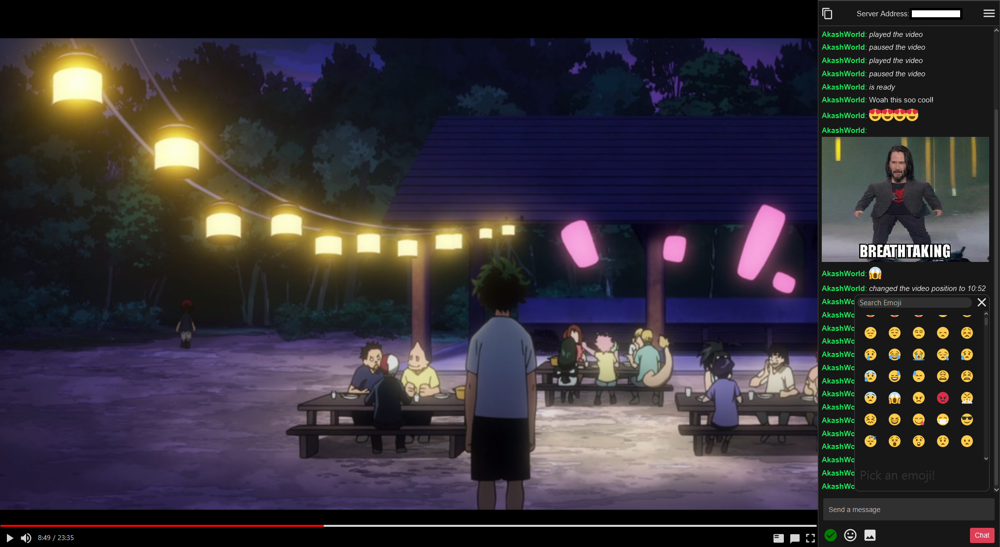

<p align="center">
    
</p>

# Carousel

## Intro
This application is a self-hosted video syncing application. In scenarios where multiple people would like to watch their favorite movies/tv shows together but can't without high bandwidth stream sharing, Carousel comes to the rescue! As long as all participants has access to the same video file locally, Carousel will sync together the video timestamps and pause/play state of the video! Perfect for a good movie night when you aren't near your friends. It also includes a chat which allows you to share emojis and memes.



## Download
[Windows x64 Setup](https://github.com/AkashWorld/carousal/releases/download/v0.2-alpha/carousal_setup_v0.2.exe)\
Other operating systems will be supported at a later time.

## How does it work?
### Prerequisites
You must have the latest version of [VLC Media Player](https://www.videolan.org/vlc/index.html). 

One person (ideally the one with the best compute and network resources) hosts the server by navigating to the "Host" page; this person either must manually enable port forwarding or have a router that is capable of Universal Plug and Play (currently very buggy).   Once the server starts, share the IP address that is listed on the top left of the application with all other trusted participants and have them connect. After that, just load the video and play!

## Nerd Stuff
This application is built with Kotlin and [TornadoFX](https://tornadofx.io/) (JavaFX Kotlin wrapper) for the client side application. It uses GraphQL as it's network api to connect to the server. The server used is [Javalin](https://javalin.io/) (a wrapper around Jetty) to handle GraphQL post and websocket requests. The media player uses [VlcJ](https://github.com/caprica/vlcj) which is a Java wrapper around libVLC.

[com.carousal.client](./src/main/kotlin/com.carousal.client) is the client\
The entry point of the application is Main.kt in com.carousal.client.
Largely, the architecture followed is the standard MVC architecture but it's not very strictly followed.

[com.carousal.server](./src/main/kotlin/com.carousal.server) is the server\
The entry point of the server is the singleton Server.kt in com.carousal.server. It uses GraphQL to fetch data via the DataFetchers; which subsequently call the very simple models to keep the data.

### How to develop
This project was developed with JDK 11 but JDK 9 should suffice at the minimum.

To run the application via the command line, simply input
```
gradle run
```

To build the distribution
```
gradle installDist
```

Tests ending with *FX.kt are not unit tests, but rather show certain view components. There are other tests that interact with the server but are likely broken.

## Contributers
[Khalid Akash](https://github.com/akashworld) - Creator/Maintainer

## License
[GPL3](./LICENSE)
